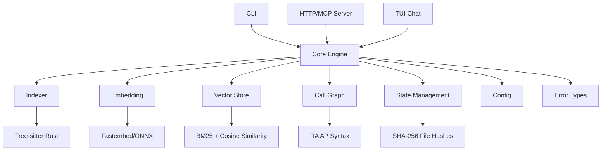

# RustRAG v0.7.14

**Local RAG for Rust codebases — full offline embeddings, hybrid BM25+vector search, MCP server.**

A self-hosted Retrieval-Augmented Generation tool built specifically for analyzing Rust Cargo workspaces. Index any workspace using AST-level semantic chunking (tree-sitter), embed with a local ONNX model, and query via CLI (with streaming output), HTTP API, or MCP protocol — entirely offline once models are downloaded.

## Features

- **AST-aware indexing** — tree-sitter-rust parses source files into semantic chunks (functions, impl blocks, unsafe regions, traits, modules, structs, enums, macros) instead of naive fixed-size text splits
- **Hybrid search (BM25 + vector)** — full inverted index with standard BM25 scoring combined with cosine similarity via configurable alpha blending (~0.7 recommended)
- **Fully local embeddings** — fastembed ONNX runtime runs `bge-small-en-v1.5` locally; no external API calls needed for embedding computation
- **Embedding cache with model versioning** — JSONL-based persistent cache includes a model_id marker; automatically invalidated when the embedding model changes (different weights or dimensions), preventing stale results
- **Automatic model download** — if no local model is found, `rust-rag` auto-downloads `bge-small-en-v1.5` (~127 MB) from HuggingFace to `~/.cache/huggingface/hub/`; supports both flat and standard HF cache layouts
- **Configurable chunk overlap** — adjacent AST-extracted chunks within a file get overlapping context lines to preserve cross-boundary semantics (function calls, macro invocations spanning chunk edges)
- **Call graph analysis** — AST-based call edge extraction using `ra_ap_syntax` (rust-analyzer's syntax crate); parses each chunk to find CallExpr nodes and extract callee names
- **MCP server** — Model Context Protocol stdio server exposing `rag_search`, `rag_workspace_info`, and `rag_file_read` tools for AI coding agents; designed for agent-only use without requiring external LLM calls
- **Interactive TUI chat** — ratatui-based terminal interface (`rust-rag chat`) with scrollable results, real-time streaming LLM answers, keyboard navigation, and live result pane
- **HTTP API + CORS** — axum server with `/search` (POST/JSON), `/query` (POST/JSON, full RAG with LLM), `/query/stream` (SSE), and `/status` endpoints; SSE streaming support; cross-origin support for browser clients
- **Incremental indexing** — SHA-256-based file change detection with O(1) comparison (no redundant full-file scans); only re-indexes changed/new/deleted files. Stored in `.rustrag/index_state.json` for persistence across invocations.
- **Symbol search** — `rust-rag symbol <name>` finds symbols by name across the index, showing kind (Function/ImplBlock/etc.), file path and line number.
- **Semantic answer cache** — caches LLM answers in `semantic_cache.jsonl`; on repeated or semantically similar questions (cosine similarity ≥ 0.85), returns the cached answer instantly without an LLM call. Configurable TTL (default: 1 hour). Opt-in via config.
- **Rate limiting** — sliding-window per-client rate limiter prevents API abuse; default budget is configurable requests per minute.
- **LLM request timeouts** — 2-minute timeout for full responses, 5-minute timeout for streaming sessions with per-chunk read limits to prevent hung connections.
- **Context size limit** — max assembled context sent to the LLM (default: 12 KB); preserves complete chunk blocks without partial splits.
- **Configurable via TOML** — `.rustrag.toml` at workspace root controls embedding model path, LLM endpoint/model, top_k, chunk overlap, and semantic cache settings

## Architecture
## Architecture

RustRag is composed of eleven independent crates that work together to provide a full-featured RAG system.

The following diagram illustrates the high-level architecture:


# Force full re-index (ignores incremental detection)
./target/release/rust-rag index --force /path/to/cargo/workspace
```

This runs the full pipeline: AST extraction → embedding → vector store creation with caching. Subsequent runs only process changed/new/deleted files.

### Ask a question

```bash
# Single query (returns LLM answer)
./target/release/rust-rag ask "How does the call graph work?" -p /workspace/path

# JSON output for scripting
./target/release/rust-rag ask --json "How does the call graph work?" -p /workspace/path

# Streaming output (incremental real-time display)
./target/release/rust-rag ask --stream "How does the call graph work?" -p /workspace/path

# Interactive TUI chat session with scrollable results and LLM answer pane
./target/release/rust-rag chat -p /workspace/path
```

### Start HTTP API server

```bash
# Defaults to port 8090; set workspace via env var or CWD
./target/release/rust-rag-serve serve --port 8090

# MCP stdio server (for AI coding agents)
RUSRAG_WORKSPACE=/workspace/path ./target/release/rust-rag-serve mcp
```

#### Server command-line flags

| Flag | Description | Default |
|------|-------------|---------|
| `--port <PORT>` | Port to listen on | `8090` |
| `--rate-limit <N>` | Max requests per minute for rate limiting (per-client) | `60` |
| `--max-context-size <BYTES>` | Maximum context size in bytes sent to the LLM | from config/env (`RUSRAG_MAX_CONTEXT_SIZE`) |

#### Server subcommands

| Command | Description | Usage |
|---------|-------------|-------|
| `serve [options]` | Start HTTP API server with CORS, rate limiting, and bearer auth | `rust-rag-serve serve --port 8090` |
| `mcp [path]` | Start MCP stdio server for AI coding agents | `rust-rag-serve mcp /workspace/path` |

## CLI Reference

| Command | Description | Usage |
|---------|-------------|-------|
| `index <path>` | Full indexing pipeline: AST extraction → ONNX embedding → vector store creation | `rust-rag index /workspace` |
| `reindex <path>` | Remove old `.rustrag/` directory, then run full indexing pipeline | `rust-rag reindex /workspace` |
| `info [-p path] [--json]` | Show index metadata (total chunks, file count). Use --json for structured output | `rust-rag info --json` |
| `clean [-p path]` | Remove `.rustrag/` directory entirely | `rust-rag clean -p /workspace` |
| `ask <query> [-p path] [--stream] [--json]` | Ask a question; returns LLM answer with cited source locations. Use --stream for incremental streaming output, --json for structured JSON output suitable for scripting | `rust-rag ask "Where is config loaded?" --json` |
| `chat [-p path]` | Start interactive TUI chat session with scrollable results and real-time LLM answers (supports live streaming) | `rust-rag chat -p /workspace` |
| `download [path]` | Download the embedding model (`bge-small-en-v1.5`) from HuggingFace to a specified directory (defaults to `~/.cache/huggingface/hub/`) | `rust-rag download ~/.cache/huggingface/hub/` |
| `symbol <name> [-p path] [--json]` | Search for a symbol by name in the indexed workspace, showing kind, file path and line number. Use --json for structured output | `rust-rag symbol "search_symbol" --json` |
| `stats [-p path] [--json]` | Show chunking diagnostics (symbol kind breakdown, overlap statistics). Use --json for structured output | `rust-rag stats --json` |

## Server API

### HTTP Endpoints

All endpoints (except `/status`) require Bearer token authentication if `RUSRAG_API_KEY` is set.
All endpoints enforce per-client rate limiting (default 60 requests per minute).

**GET `/status`** — Workspace metadata
- Response: `{ "total_chunks": <int>, "endpoint": "<llm_endpoint>" }`
- No authentication required.

**POST `/search`** — Hybrid semantic search (no LLM)
- Request (JSON): `{ "query": "<string>", "top_k": <int, optional, default 5> }`
- Response: `{ "results": [ { "id": "...", "file_path": "...", "line_start": <int>, "line_end": <int>, "module_name": "...", "symbol_kind": "...", "text": "...", "score": <float> } ] }`
- Errors: 400 (query too long, >4096 chars), 401 (missing/invalid token), 429 (rate limit), 500 (embedding/search failure).

**POST `/query`** — Full RAG with LLM answer and citations (checks semantic cache)
- Request (JSON): `{ "question": "<string>" }`
- `top_k` is taken from config (default 5) — not customizable per request.
- Response (cache miss): `{ "answer": "...", "citations": [ { "file_path": "...", "line_start": <int>, "line_end": <int>, "text": "..." } ], "cached": false }`
- Response (cache hit): `{ "answer": "...", "citations": [], "cached": true }`
- Errors: same as `/search`, plus 500 on LLM timeout (120s).

**GET `/query/stream`** — Streamed LLM answer via Server-Sent Events (SSE)
- Query parameters: `question` (string, required), `top_k` (int, optional, default from config)
- Returns `text/event-stream` with incremental tokens; each chunk is a SSE `data:` message.
- If semantic cache hit, streams the cached answer as a single SSE message.
- Errors: same as `/query`, but streamed as SSE error events.
- Timeout: 5 minutes for the entire streaming session; per-chunk read timeout 60s.

**Example:**
```bash
curl -H 'Accept: text/event-stream' "http://localhost:8090/query/stream?question=How+does+embedding+work"
```

**Error Codes:**
- `400 Bad Request` — invalid input (query too long, malformed JSON)
- `401 Unauthorized` — missing or invalid Bearer token (if `RUSRAG_API_KEY` set)
- `429 Too Many Requests` — rate limit exceeded (per client IP)
- `404 Not Found` — route not found
- `500 Internal Server Error` — embedding, search, or LLM failure


### MCP Protocol

Implements **MCP stdio transport** (protocol version `2024-11-05`) with three tools:

| Tool | Description | Arguments |
|------|-------------|-----------|
| `rag_search` | Semantic search over indexed code chunks. Supports single or batch queries (up to 10). Returns raw snippets with BM25+vector scores, file paths, line numbers, and metadata. Optional filters by file extension or symbol kind. | `query` (string, max 4096) **or** `queries` (array, 1–10 strings) — search query(s); `top_k` (integer, 1–100, default 5); `filters` (object) — `file_extension` (string), `symbol_kind` (string), `crates` (string array, ignored for now) |
| `rag_workspace_info` | Get structured information about the workspace: list all crates, their paths, dependencies from Cargo.toml, and README.md content | `detail_level` (`summary` or `full`, optional) — level of detail |
| `rag_file_read` | Read a file within the workspace by relative path (with directory traversal protection, 100KB limit). Optionally extract a line range. | `file_path` (string, required); `line_start` (integer, optional); `line_end` (integer, optional) |

**Design philosophy**: The MCP tools are designed for **AI coding agents** — they return raw code chunks without requiring an external LLM. Agents (`rag_search`) can analyze the returned code directly.

The MCP server exposes itself over stdio: send JSON-RPC 2.0 requests on stdin and read responses from stdout. Supports `initialize`, `notifications/initialized`, `tools/list`, and `tools/call` methods.

**Examples:**

Single query:
```json
{
  "jsonrpc": "2.0",
  "id": 1,
  "method": "tools/call",
  "params": {
    "name": "rag_search",
    "arguments": {
      "query": "embedding model initialization",
      "top_k": 3
    }
  }
}
```

Batch query with filters:
```json
{
  "jsonrpc": "2.0",
  "id": 2,
  "method": "tools/call",
  "params": {
    "name": "rag_search",
    "arguments": {
      "queries": ["rate limiter", "SSRF protection"],
      "top_k": 2,
      "filters": {
        "file_extension": "rs",
        "symbol_kind": "Function"
      }
    }
  }
}
```

Read a file with line range:
```json
{
  "jsonrpc": "2.0",
  "id": 3,
  "method": "tools/call",
  "params": {
    "name": "rag_file_read",
    "arguments": {
      "file_path": "crates/server/src/lib.rs",
      "line_start": 100,
      "line_end": 120
    }
  }
}
```

### Connecting an AI Agent via MCP

MCP uses a **stdio transport**: the server runs as a subprocess, reads JSON-RPC requests from stdin, and writes responses to stdout. Connect any MCP-compatible agent by launching `rust-rag-serve mcp` with the workspace path.

#### Claude Desktop (Claude Code)

Add RustRAG to your Claude Desktop config (`~/Library/Application Support/Claude/claude_desktop_config.json` on macOS or `~/.config/claude-desktop/config.json` on Linux):

```json
{
  "mcpServers": {
    "rust-rag": {
      "command": "./target/release/rust-rag-serve",
      "args": ["mcp", "/path/to/workspace"],
      "env": {}
    }
  }
}
```

After adding, restart Claude Desktop. The agent will see three tools: `rag_search`, `rag_workspace_info`, and `rag_file_read`.

#### Cursor / Windsurf / Codespaces

Most MCP-compatible IDEs accept a JSON config file or environment variable. For example in Cursor, add to `.cursor/mcp.json`:

```json
{
  "mcpServers": {
    "rust-rag": {
      "command": "./target/release/rust-rag-serve",
      "args": ["mcp", "/path/to/workspace"]
    }
  }
}
```

#### Kimi Code 

To connect RustRAG to Kimi Code:

1. Run `cargo build --release` to produce `target/release/rust-rag-serve`
2. **Index the workspace** — run `rust-rag index /path/to/workspace` (or `reindex` to rebuild). The MCP tools won't return results until an index exists.
3. Set the workspace path and invoke `rust-rag-serve mcp /path/to/workspace` as a stdio MCP server in your Kimi Code session (add `.mcp/agents.json` or use the CLI config)
4. The agent will see three tools: `rag_search`, `rag_workspace_info`, and `rag_file_read`

For this project itself, running any RustRAG command from within `/home/odolen/RustRag` automatically uses the workspace root — no extra setup needed. That's how you're reading this right now.

#### Manual testing with raw JSON-RPC

The MCP server reads all requests from stdin until EOF. Send multiple requests in a single session:

```bash
# Send initialize → tools/list → tools/call in one session:
./target/release/rust-rag-serve mcp /path/to/workspace <<'EOF'
{"jsonrpc":"2.0","id":1,"method":"initialize","params":{"protocolVersion":"2024-11-05"}}
{"jsonrpc":"2.0","id":2,"method":"tools/list"}
{"jsonrpc":"2.0","id":3,"method":"tools/call","params":{"name":"rag_search","arguments":{"query":"embedding model","top_k":3}}}
EOF
```

Each line is a separate JSON-RPC request; responses are written to stdout as the server processes them.

#### Environment variables during MCP execution

| Variable | Purpose | Default |
|----------|---------|---------|
| `RUSRAG_WORKSPACE` | Workspace root (overrides `[PATH]` argument) | current directory |
| `RUSRAG_API_KEY` | Bearer token required by `rag_search` endpoint if auth is configured | none |

The MCP server reads `.rustrag.toml` from the workspace root and applies all embedding, LLM, and cache settings — no extra configuration needed.

## Model Auto-Download

When no local model is found, `rust-rag download` (or the first search/query command) automatically downloads `bge-small-en-v1.5` from HuggingFace:

```bash
# Manual download to a specific directory
./target/release/rust-rag download ~/.cache/huggingface/hub/

# Or just run any command — it will prompt and auto-download
./target/release/rust-rag index /path/to/workspace
```

The model is saved in the standard HuggingFace cache layout. You can also set `RUSRAG_MODEL_PATH` to point to a custom directory containing `model.onnx`, `tokenizer.json`, etc.

## Configuration

All settings in `.rustrag.toml` at workspace root:

```toml
[embedding]
# Directory containing model.onnx, tokenizer.json, config.json, etc.
model_path = "./Download"

# Adjacent lines to include before/after each chunk (0 = exact AST boundaries)
chunk_overlap = 3

[llm]
# OpenAI-compatible /chat/completions endpoint (supports Ollama too)
endpoint = "http://localhost:8080"

# Model name used by the LLM server. Leave empty to auto-detect from /v1/models.
model = ""  # auto-detects first available model if empty

top_k = 5

# Maximum size in bytes of assembled context sent to the LLM (optional)
max_context_size = 12000

[semantic_cache]
# Enable/disable semantic caching of LLM answers (default: false)
enabled = true

# Time-to-live in seconds for cached entries (default: 3600 = 1 hour)
ttl_secs = 3600
```

**Environment variable overrides** (highest priority):

| Variable | Applies To | Default |
|----------|-----------|---------|
| `RUSRAG_MODEL_PATH` | Embedding model path (above config file) | — |
| `LLAMA_ENDPOINT` | LLM HTTP endpoint (`http://host:port/chat/completions`) | from config or default |
| `LLAMA_MODEL` | LLM model name (overrides config; empty = auto-detect from `/v1/models`) | from config or default |
| `RUSRAG_WORKSPACE` | Server workspace root | current directory |
| `RUSRAG_API_KEY` | Bearer token for HTTP API authentication | none (auth disabled) |
| `RUSRAG_SEMANTIC_CACHE_ENABLED` | Enable/disable semantic answer cache | `false` (opt-in) |
| `RUSRAG_SEMANTIC_CACHE_TTL` | Semantic cache TTL in seconds | `3600` (1 hour) |
| `RUSRAG_MAX_CONTEXT_SIZE` | Max assembled context bytes sent to LLM | `12000` (12 KB) |
| `RUSRAG_SSRF_STRICT` | Enable strict SSRF mode — reject private IPs and cloud metadata URLs instead of merely warning | disabled by default |

**Model auto-detection**: When `model = ""` in config or no `LLAMA_MODEL` env var is set, the server automatically queries the LLM endpoint's `/v1/models` API and uses the first available model. This eliminates the need to manually configure the model name.

## Testing

```bash
cargo test --package rust-rag-core
# Runs 59+ tests covering: indexing, incremental state management, vector store roundtrip,
# cosine similarity, hybrid search alpha blending, BM25 scoring, filters (symbol kind + file extension),
# document removal, semantic answer cache (exact + similarity lookup, TTL expiry, persistence)

cargo test --package rust-rag-server
# Runs 14+ tests covering: rate limiter, auth, context trimming, server handlers

cargo test --workspace
# Runs 200+ tests across all workspace crates
```

## Security Features

- **SSRF protection** — LLM endpoints validated before client creation by resolving hostnames to IPs and checking for private/cloud metadata addresses. Blocks localhost-style hostnames (`.localhost`, `.local`).
- **DNS rebinding protection** — hostname resolution performed before endpoint validation; resolves all resolved addresses to detect mixed public/private targets.
- **SSRF strict mode** — set `RUSRAG_SSRF_STRICT=1` to reject private IPs entirely instead of merely warning.
- **Bearer token authentication** — all endpoints except `/status` require `Authorization: Bearer <key>` when `RUSRAG_API_KEY` is configured.
- **Per-client rate limiting** — sliding-window limiter prevents API abuse; one IP can make at most N requests per minute (default: 60).
- **Atomic file writes** — embedding cache uses temp-file + rename to prevent corruption on crash.

## How It Works

1. **Indexing** — `walkdir` walks workspace members; tree-sitter-rust parses each `.rs` file into an AST; semantic nodes are extracted as chunks with metadata (file path, line range, module name, symbol kind). SHA-256 hashes tracked in `.rustrag/index_state.json`.
2. **Incremental indexing** — on subsequent runs, file hashes are compared against stored state via O(1) lookup; only new/changed/deleted files trigger re-parsing and embedding. Removed files' documents are deleted from the index atomically.
3. **Chunk overlap** — after extraction, adjacent chunks within the same file get context lines from neighbors using an efficient byte-offset-to-line mapping (O(log N) binary search); each file is read only once regardless of chunk count.
4. **Embedding** — each chunk text is embedded via fastembed's ONNX runtime; results are cached in JSONL with model_id versioning for automatic invalidation on model change. Batch embedding processes all chunks in a single ONNX inference call instead of N individual calls.
5. **Vector store** — embeddings + metadata stored as JSONL with an in-memory BM25 inverted index built lazily at query time; documents are cached with mtime-based invalidation to avoid re-parsing on every search.
6. **Retrieval** — hybrid search combines cosine similarity (vector) and BM25 text scoring via alpha-weighted blend; each document's vector similarity is computed once and reused for both ranking and result display. Filters by symbol kind or file extension applied post-ranking.
7. **Semantic cache lookup** — before calling the LLM, the system embeds the question and checks `semantic_cache.jsonl` for exact or semantically similar (cosine similarity ≥ 0.85) cached answers. Cache entries expire after a configurable TTL (default: 1 hour).
8. **LLM answer** — if no cache hit, retrieved context is assembled with citations and sent to the configured LLM endpoint; supports both full-response and SSE streaming modes. Responses are written back to the semantic cache for future lookups.

## License

MIT
